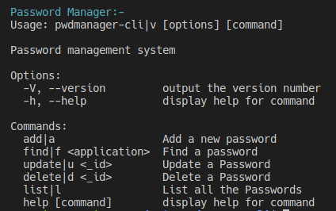

# Password Manager (CLI) :--

Command line interface for managing passwords.


## Installation:-

Install the dependencies

```sh
$ npm install
```


## Create Symlink:-

```sh
$ npm link
```


## Usage:-


#### Add Application (add or a)
```sh
$ pwdmanager-cli add
```


#### List Application (list or l)
```sh
$ pwdmanager-cli list
```


#### Find Application (find or f)
```sh
$ pwdmanager-cli find [application_name]
```


#### Update Application (update or u)
```sh
$ pwdmanager-cli update [application_name]
```
Prompts for detatils to update!


#### Remove Application (remove or r)
```sh
$ pwdmanager-cli remove [application_name]
```
Deletes the application provided!


## App Info

Author - Nilay Gupta

Version - 1.0.0

